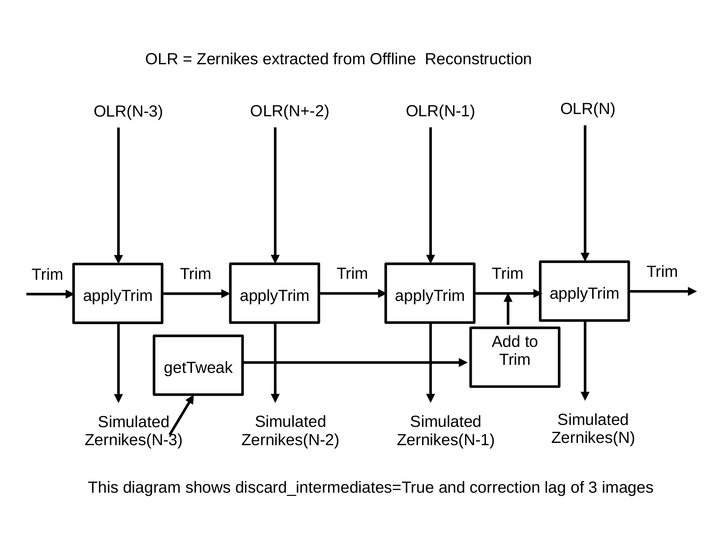
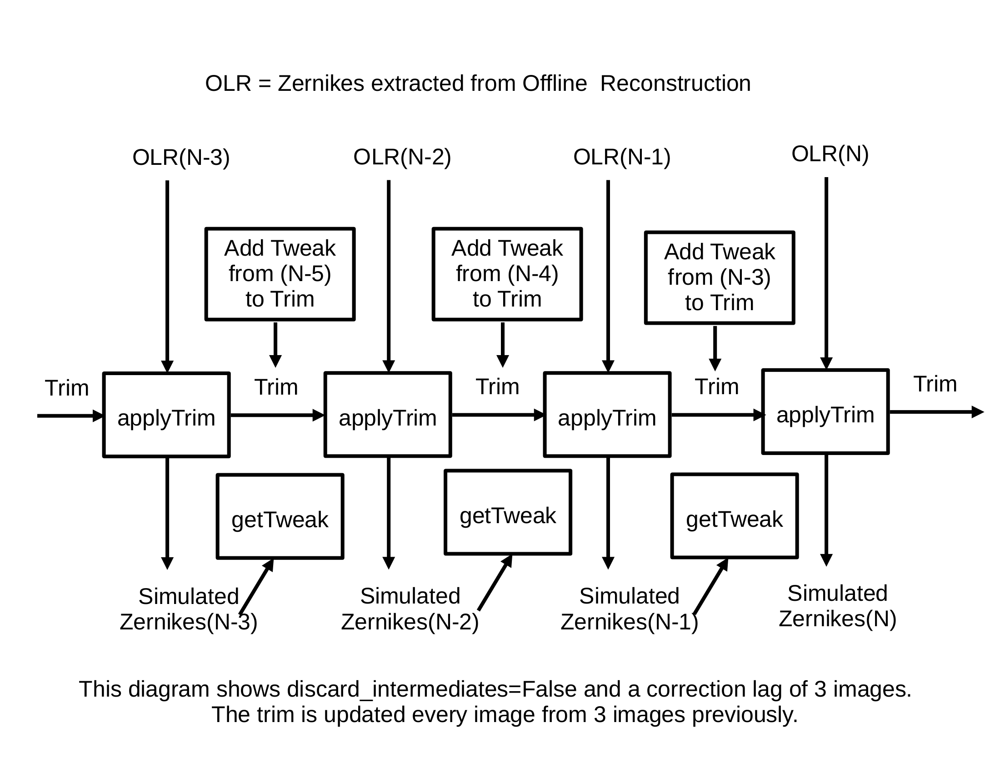
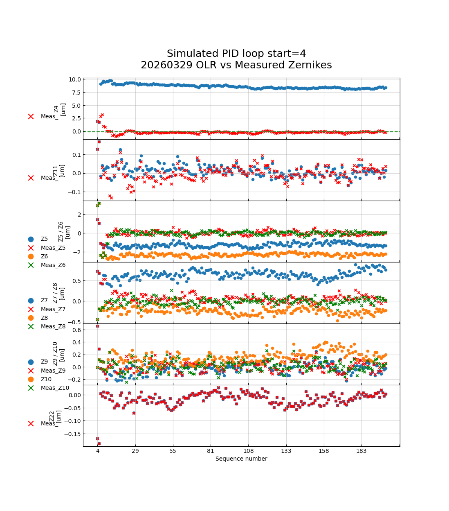
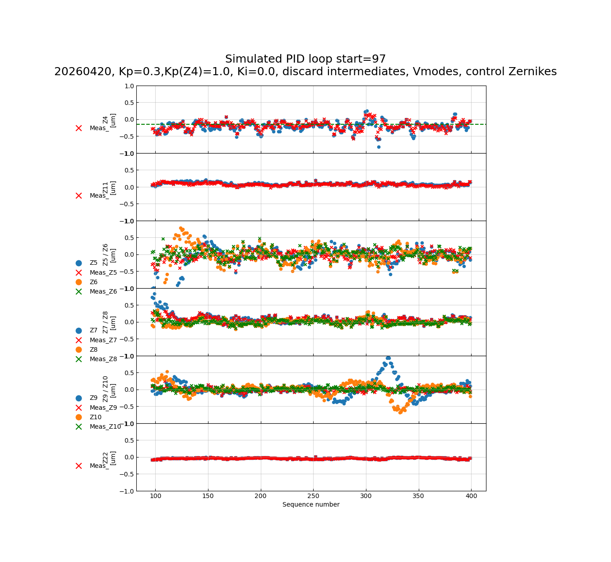
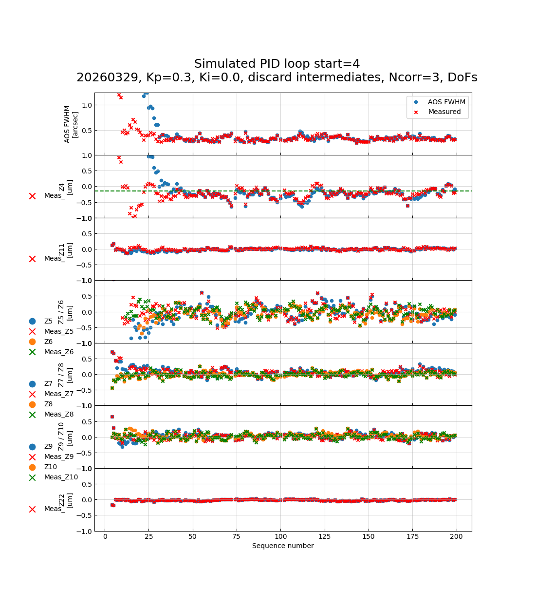
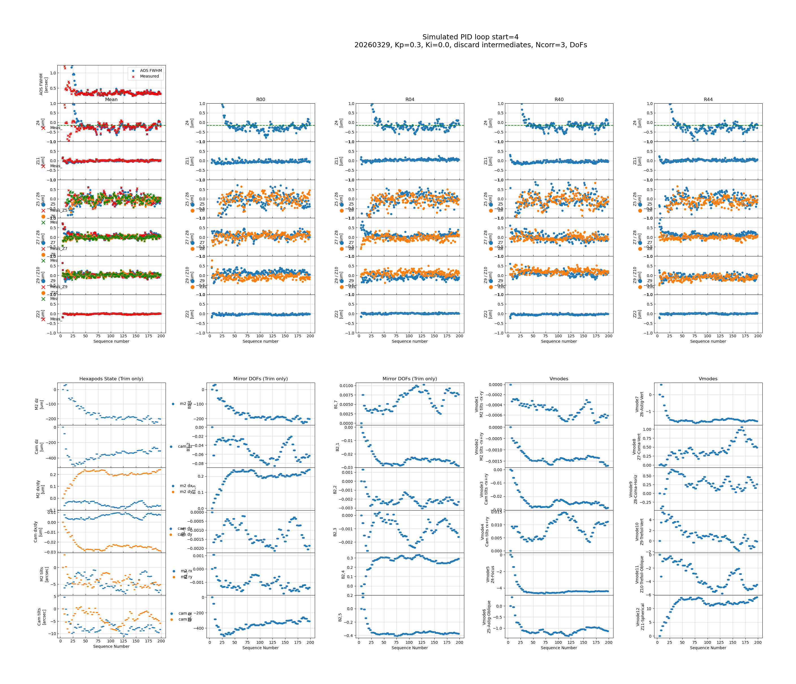
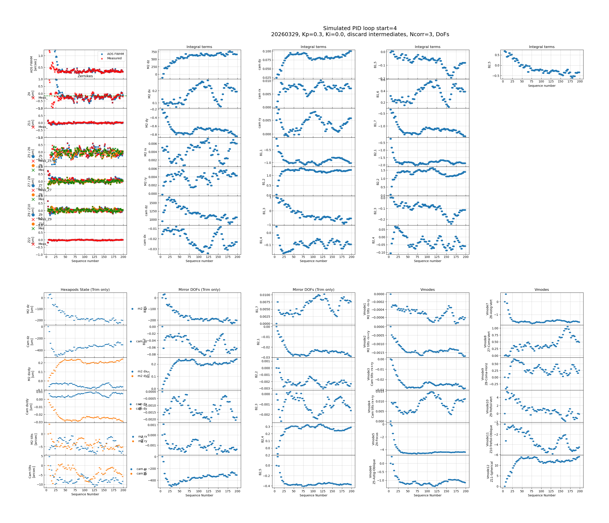
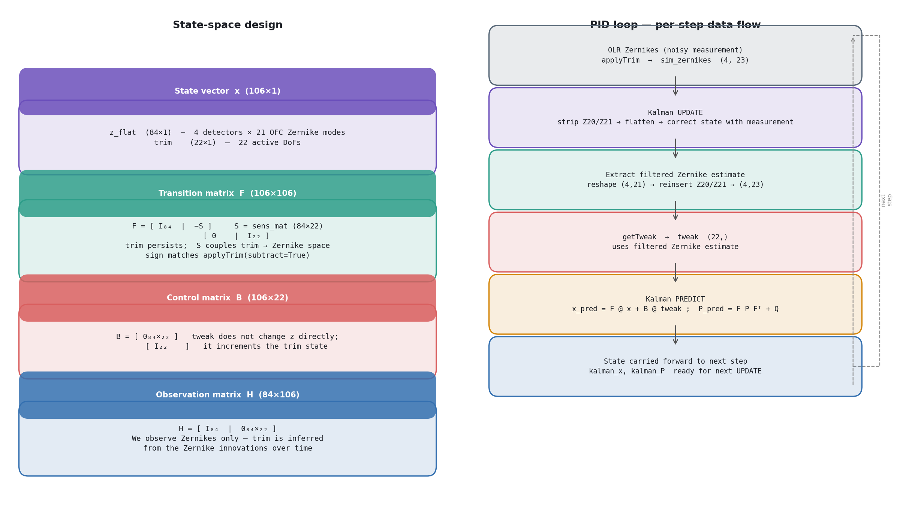

.. _index:

#####################################################
AOS Control Loop Testing with Open-Loop Reproductions
#####################################################

.. abstract::

   The MTAOS control loop is complex and has many parameters.
   In addition, because the measured Zernikes are noisy, and because of
   night-to-night variation, it is difficult to make definitive tests on sky.
   This technote describes a simulation package that allows testing alternate
   control loop schemes using on-sky data from which the calculated corrections
   have been removed, giving an effective stream of open-loop Zernike
   measurements.  First results from the simulator are presented, including
   comparisons of different correction strategies, an investigation of
   Degree-of-Freedom (DoF) versus virtual-mode (Vmode) control, a study of
   the Z4/Z11 cross-coupling, control in Zernike input space, and the
   addition of an optional Kalman filter.

Acknowledgements: Aaron Roodman, Guillem Megias, Tiago Ribeiro, and
Chuck Claver.

.. _intro:

Introduction
============

The MTAOS active optics system corrects wavefront errors in the Vera C.
Rubin Observatory by adjusting the Camera and M2 hexapods and the M1M3
and M2 mirror bending modes.  Corrections are calculated from Zernike
coefficient measurements at four corner detectors and are applied once
per visit.  Testing different control strategies on sky is difficult
because (a) Zernike measurements are noisy, (b) sky conditions vary from
night to night, and (c) each on-sky test consumes precious observing time.

This technote describes a software simulator that sidesteps these
difficulties by replaying a recorded night of data in simulation.  The
key idea is the *open-loop reproduction* (OLR): the accumulated
degree-of-freedom (DoF) corrections (the *trim*) are subtracted from the
measured Zernikes, reconstructing what the wavefront would have looked
like had no corrections ever been applied.  Any PID control strategy can
then be applied to this OLR stream, allowing a direct, reproducible
comparison of different strategies against real atmospheric and
instrumental disturbances.

Terminology used throughout this document follows the conventions of
Aaron Roodman:

- **Tweak** — the per-visit change in DoFs commanded to bring the
  Zernikes to their target values (called ``visit_dof`` in the EFD).
- **Trim** — the accumulated sum of tweaks (also called ``dof_state``).
  The trim does not include the Look-Up Table (LUT) correction.

The simulation code is available at:
https://github.com/lsst-so/ts_aos_analysis/blob/tickets/RSO-441/notebooks/pid_simulations/PID_Loop_Simulation_Kalman_04May26.ipynb

.. _methodology:

Methodology
===========

The simulation proceeds in three steps.

**Step 1 — Build the open-loop reproduction.**
For each exposure in a chosen night, the recorded Zernike deviations and
the applied trim (``dof_state``) are read from the nightly parquet file.
The sensitivity matrix :math:`S` (mapping DoF changes to Zernike changes)
is used to add back the effect of the trim, yielding the open-loop
Zernike stream:

.. math::

   \mathbf{z}_\mathrm{OLR}(N) = \mathbf{z}_\mathrm{meas}(N) + S\,\mathbf{t}(N)

where :math:`\mathbf{t}(N)` is the trim applied before exposure :math:`N`.

**Step 2 — Run the simulated PID loop.**
Starting from zero trim, the OLR Zernikes are fed through the PID
controller visit by visit.  At each step, the current trim is subtracted
from the OLR Zernikes (via ``applyTrim``) to obtain the simulated
Zernikes, which are passed to ``getTweak`` (the OFC) to compute the
next correction.  The correction is accumulated into the trim and the
loop advances to the next visit.

**Step 3 — Analyse and plot results.**
Simulated Zernike residuals, DoF/Vmode trims, integral terms, and the
AOS contribution to the PSF FWHM are available as stored arrays and can
be visualised with the built-in plotting methods.

Two *correction lag* modes are supported, illustrated in
:numref:`fig-schematic-1` and :numref:`fig-schematic-2`:

- ``discard_intermediates=True`` — a new tweak is computed only every
  :math:`N_\mathrm{corr}` visits; intermediate visits use the last
  applied trim unchanged.
- ``discard_intermediates=False`` — a new tweak is computed every visit
  but applied with a lag of :math:`N_\mathrm{corr}` visits, mimicking
  the pipeline processing delay.

   Schematic of the ``discard_intermediates=True`` strategy with a
   correction lag of three visits.  A tweak is calculated from the
   simulated Zernikes at exposure :math:`N-3` and added to the trim
   before exposure :math:`N`.  Intermediate exposures use the
   unchanged trim.

   Schematic of the ``discard_intermediates=False`` strategy with a
   correction lag of three visits.  A new tweak is computed every
   visit but the tweak applied to visit :math:`N` was computed three
   visits earlier, so every visit benefits from the most recent
   available correction.

.. _olr:

Open-Loop Reconstruction
========================

:numref:`fig-olr` shows the OLR Zernike stream (circles) alongside the
original measured Zernikes (crosses) for the night of 20260329.
The OLR Z4 signal is notably larger than the measured value because the
Camera and M2 dZ trims — which had been suppressing the Z4 error — have
been removed.  The OLR stream is the "true" open-loop disturbance that
the PID loop must learn to reject.

   Open-loop reproduction (circles) versus measured Zernikes (crosses)
   for night 20260329.  The large OLR Z4 signal reflects the dZ trims
   that have been removed.

.. _intermediates:

Impact of Intermediate Updates
===============================

.. _delays-n3:

Correction Lag of N+3
---------------------

:numref:`fig-A1` through :numref:`fig-A4` compare ``Kp = 0.3`` and
``Kp = 0.5`` with and without discarding intermediate updates, using a
correction lag of three visits.

With ``discard_intermediates=True`` the loop is stable for both gain
values.  With ``discard_intermediates=False`` and ``Kp = 0.5``, the
loop begins to oscillate — a well-known consequence of the three-visit
lag acting with high gain.  Even with ``Kp = 0.3`` oscillations are
beginning.

.. list-table::
   :widths: 50 50
   :header-rows: 0

   * - .. figure:: _static/PID_Simulator_A1_20260329.png
          :name: fig-A1
          :alt: Kp=0.3, discard intermediates, N+3

          Kp=0.3, discard intermediates.

     - .. figure:: _static/PID_Simulator_A3_20260329.png
          :name: fig-A3
          :alt: Kp=0.3, keep intermediates, N+3

          Kp=0.3, keep intermediates.

   * - .. figure:: _static/PID_Simulator_A2_20260329.png
          :name: fig-A2
          :alt: Kp=0.5, discard intermediates, N+3

          Kp=0.5, discard intermediates.

     - .. figure:: _static/PID_Simulator_A4_20260329.png
          :name: fig-A4
          :alt: Kp=0.5, keep intermediates, N+3

          Kp=0.5, keep intermediates.  Oscillations are clearly visible.

.. _delays-n2:

Correction Lag of N+2
---------------------

:numref:`fig-K1` through :numref:`fig-K4` repeat the comparison with a
two-visit lag.  Reducing the lag to two visits allows the
keep-intermediates loop to remain stable at ``Kp = 0.5``, illustrating
the expected trade-off between lag and maximum stable gain.

.. list-table::
   :widths: 50 50
   :header-rows: 0

   * - .. figure:: _static/PID_Simulator_K1_20260329.png
          :name: fig-K1
          :alt: Kp=0.3, discard intermediates, N+2

          Kp=0.3, discard intermediates.

     - .. figure:: _static/PID_Simulator_K3_20260329.png
          :name: fig-K3
          :alt: Kp=0.3, keep intermediates, N+2

          Kp=0.3, keep intermediates.

   * - .. figure:: _static/PID_Simulator_K2_20260329.png
          :name: fig-K2
          :alt: Kp=0.5, discard intermediates, N+2

          Kp=0.5, discard intermediates.

     - .. figure:: _static/PID_Simulator_K4_20260329.png
          :name: fig-K4
          :alt: Kp=0.5, keep intermediates, N+2

          Kp=0.5, keep intermediates.  Stable at this gain, unlike the
          N+3 case.

.. _smith:

Using the Smith Predictor/Corrector
------------------------------------

Per a suggestion from Guillem Megias, a Smith predictor/corrector can be
added to compensate for the correction lag.  The algorithm modifies the
Zernike input to ``getTweak`` as follows:

.. math::

   \mathbf{z}_\mathrm{input}(N) = \mathbf{z}_\mathrm{sim}(N)
   + S\,\bigl[\mathbf{t}(N-1) - \mathbf{t}(N-2)\bigr]

This uses the most recent change in the trim to predict the Zernike
improvement that the pending correction will deliver, effectively
removing the lag from the controller's perspective.

:numref:`fig-F13` and :numref:`fig-F15` show the improvement from the
Smith corrector at N+3 lag; :numref:`fig-K5` shows the same at N+2 lag.
The Smith corrector substantially reduces the residual Zernike scatter
in the keep-intermediates regime with a lag of three visits, but the
benefit is less clear with a lag of two visits.

.. list-table::
   :widths: 50 50
   :header-rows: 0

   * - .. figure:: _static/PID_Simulator_F13_20260329.png
          :name: fig-F13
          :alt: Keep intermediates, Kp=0.3, Smith corrector, N+3

          Keep intermediates, Kp=0.3, with Smith corrector (N+3).

     - .. figure:: _static/PID_Simulator_F15_20260329.png
          :name: fig-F15
          :alt: Keep intermediates, Kp=0.2, Smith corrector, N+3

          Keep intermediates, Kp=0.2, with Smith corrector (N+3).

   * - .. figure:: _static/PID_Simulator_K5_20260329.png
          :name: fig-K5
          :alt: Keep intermediates, Kp=0.3, Smith corrector, N+2

          Keep intermediates, Kp=0.3, with Smith corrector (N+2).

     -

.. _recovery:

How Well Do We Recover the Original Measured Zernikes?
=======================================================

A useful sanity check is to compare the simulated Zernike residuals with
the original on-sky measurements.  If the simulation is correct, running
the loop with the same parameters that were used on sky should
approximately reproduce the measured Zernike stream.

:numref:`fig-M1` and :numref:`fig-M4` show nights where the recovery is
good.  :numref:`fig-M3` and :numref:`fig-M5` show nights where
significant discrepancies appear, particularly in the higher-order
Zernikes.  A possible explanation is that the bending-mode actuator
limits applied on sky are not captured in the simulation.  This needs
to be better understood.

.. list-table::
   :widths: 50 50
   :header-rows: 0

   * - .. figure:: _static/PID_Simulator_M1_20260329.png
          :name: fig-M1
          :alt: Simulation vs measured Zernikes, 20260329

          Night 20260329 — simulation (circles) versus measured (crosses).
          Recovery is good.

     - .. figure:: _static/PID_Simulator_M4_20260415.png
          :name: fig-M4
          :alt: Simulation vs measured Zernikes, 20260415

          Night 20260415 — simulation (circles) versus measured (crosses).
          Recovery is good.

   * - .. figure:: _static/PID_Simulator_M3_20260412.png
          :name: fig-M3
          :alt: Simulation vs measured Zernikes, 20260412

          Night 20260412 — higher-order Zernikes show significant
          disagreement.

     - .. figure:: _static/PID_Simulator_M5_20260415.png
          :name: fig-M5
          :alt: Simulation vs measured Zernikes, 20260415 (different range)

          Night 20260415 (different sequence range) — disagreement visible
          in higher-order Zernikes (cyan circle).

.. _vmodes:

DoFs vs. Vmode Control
=======================

The OFC can operate in either the native DoF basis or the virtual-mode
(Vmode) basis, which diagonalises the sensitivity matrix and decouples
the Zernike modes from one another.  :numref:`fig-A1-dof` and
:numref:`fig-B1` show that the Zernike residuals are visually identical
between the two bases for the same gain values.  Inspecting the stored
trim arrays during the simulation confirms that the Vmodes are what is
being controlled in both cases, because the OFC internally projects the
DoF corrections onto the Vmode basis.

.. list-table::
   :widths: 50 50
   :header-rows: 0

   * - .. figure:: _static/PID_Simulator_A1_20260329.png
          :name: fig-A1-dof
          :alt: DoF control, Kp=0.3, discard intermediates

          DoF control, Kp=0.3, discard intermediates.

     - .. figure:: _static/PID_Simulator_B1_20260329.png
          :name: fig-B1
          :alt: Vmode control, Kp=0.3, discard intermediates

          Vmode control, Kp=0.3, discard intermediates.  Results are
          visually identical to the DoF case.

The ability to specify independent gains per Vmode was verified
empirically: reducing ``Kp(Vmode5)`` from 0.3 to 0.1 visibly increases
the Z4 residuals (:numref:`fig-B2`), and reducing ``Kp(Vmode6,7)`` to
0.05 increases the astigmatism residuals (:numref:`fig-B3`), confirming
that the Vmodes are the effective control variables.

.. list-table::
   :widths: 50 50
   :header-rows: 0

   * - .. figure:: _static/PID_Simulator_B2_20260329.png
          :name: fig-B2
          :alt: Vmode control, Kp(Vmode5) reduced to 0.1

          Vmode control, Kp(Vmode5) = 0.1.  Z4 residuals increase, as
          expected.

     - .. figure:: _static/PID_Simulator_B3_20260329.png
          :name: fig-B3
          :alt: Vmode control, Kp(Vmode6,7) reduced to 0.05

          Vmode control, Kp(Vmode6,7) = 0.05.  Astigmatism residuals
          increase.

.. _z4z11:

Z4/Z11 Study
============

The Z4 (focus) and Z11 (spherical aberration) modes are of particular
interest because they are coupled through the CamZ and M2Z actuators
and tend to oscillate together.  A series of simulations was run on
night 20260420 to understand how the proportional and integral gains
affect this coupling.

.. _z4z11-kp:

Proportional Gain Study
-----------------------

:numref:`fig-Kp1` through :numref:`fig-Kp4` show the effect of
reducing the gain on Vmode 10 (which most strongly drives Z11).
Zeroing Kp(Vmode10) removes the Z11 correction entirely, while
reducing it to 0.02 provides a compromise between Z11 suppression and
M2Z/CamZ stability.  In both cases the opposing oscillations of M2Z and
CamZ are reduced.

.. list-table::
   :widths: 50 50
   :header-rows: 0

   * - .. figure:: _static/PID_Special_Kp1_20260420.png
          :name: fig-Kp1
          :alt: All Kp=0.3 (baseline)

          All Kp=0.3 (baseline).

     - .. figure:: _static/PID_Special_Kp3_20260420.png
          :name: fig-Kp3
          :alt: Kp(Vmode10) = 0.02

          Kp(Vmode10) = 0.02.

   * - .. figure:: _static/PID_Special_Kp2_20260420.png
          :name: fig-Kp2
          :alt: Kp(Vmode10) = 0.1

          Kp(Vmode10) = 0.1.

     - .. figure:: _static/PID_Special_Kp4_20260420.png
          :name: fig-Kp4
          :alt: Kp(Vmode10) = 0.0

          Kp(Vmode10) = 0.0 (Z11 gain zeroed).

.. _z4z11-ki:

Integral Gain Study (Vmodes)
-----------------------------

:numref:`fig-Ki1` through :numref:`fig-Ki4` explore the effect of
adding an integral term to Vmode 5 (focus) while keeping Kp(Vmode10)
reduced to 0.05.  Adding an integral term on Vmode 5 reduces the
low-frequency Z4 drift but can destabilise the loop if Ki is set too
large.  In general, the added control from introducing Ki is somewhat
disappointing.

.. list-table::
   :widths: 50 50
   :header-rows: 0

   * - .. figure:: _static/PID_Special_Ki1_20260420.png
          :name: fig-Ki1
          :alt: Ki(Vmode5) = 0.2

          Ki(Vmode5) = 0.2.

     - .. figure:: _static/PID_Special_Ki3_20260420.png
          :name: fig-Ki3
          :alt: Ki(Vmode5) = 1.0

          Ki(Vmode5) = 1.0.

   * - .. figure:: _static/PID_Special_Ki2_20260420.png
          :name: fig-Ki2
          :alt: Ki(Vmode5) = 0.5

          Ki(Vmode5) = 0.5.

     - .. figure:: _static/PID_Special_Ki5_20260420.png
          :name: fig-Ki4
          :alt: Ki(Vmode5) = 2.0

          Ki(Vmode5) = 2.0.

.. _zernike-control:

Control in Zernike Space
=========================

An option suggested by Chuck Claver is to move the PID control from
the DoF/Vmode output space into the Zernike input space.  In this mode
the proportional and integral gains are applied directly to the Zernike
measurements before they are passed to the OFC, allowing independent
per-Zernike (and even per-detector) gain tuning.

Positives:

- Kp and Ki can be set independently for each Zernike coefficient and
  each corner detector.
- The control action is more directly interpretable in terms of the
  observable wavefront error.

Open questions at the time of writing:

- The Kp(Z4) gain must be set substantially higher than in DoF/Vmode
  control to achieve the same Z4 suppression, suggesting a scaling
  difference that needs investigation.
- Setting Kp(Z11) = 0 reduces but does not eliminate the CamZ and M2Z
  oscillations, indicating residual coupling through other Vmodes.

:numref:`fig-zcontrol` shows an example run with ``Kp(Z4) = 1.0`` and
all other Zernikes at ``Kp = 0.3``.  :numref:`fig-ZControl1` and
:numref:`fig-ZControl3` compare the Z4/Z11 cross-coupling with and
without zeroing the Z11 gain.

   Zernike-space control, night 20260420.  Kp=0.3 for all Zernikes,
   Kp(Z4)=1.0.  Simulated Zernikes (circles) and measured Zernikes
   (crosses) are shown.

.. list-table::
   :widths: 50 50
   :header-rows: 0

   * - .. figure:: _static/PID_Special_ZControl1_20260420.png
          :name: fig-ZControl1
          :alt: Zernike control, Kp(Z4)=1.0

          Kp(Z4)=1.0, all other Kp=0.3.  Z4 is well controlled; M2Z and
          CamZ show large swings.

     - .. figure:: _static/PID_Special_ZControl3_20260420.png
          :name: fig-ZControl3
          :alt: Zernike control, Kp(Z4)=1.0, Kp(Z11)=0.0

          Kp(Z4)=1.0, Kp(Z11)=0.0.  Z11 is no longer driven, but M2Z
          and CamZ swings persist.

.. _plotting-options:

Plotting Options
================

There are three plotting options built in to the simulation class,
shown in :numref:`plot-1` through :numref:`plot-3`.

   The simplest plotting option (``plotPID``) shows the AOS FWHM and
   the six most important Zernike groups vs. sequence number.

.. rst-class:: technote-wide

   ``bigPlotPID1`` adds the Zernikes at all four corner detectors (top
   panel) and all DoF trims and Vmodes (bottom panel).

.. rst-class:: technote-wide

   ``bigPlotPID2`` replaces the per-corner Zernike columns with plots of
   the integral terms for all active DoFs.

.. _kalman:

Adding the Kalman Filter
========================

.. _kalman-methodology:

Methodology
-----------

The Zernike measurements from the corner detectors are noisy (typical
RMS ~0.05 µm per mode), which limits the achievable PID gain.  A
Kalman filter can be inserted between the ``applyTrim`` step and the
``getTweak`` step to produce an improved state estimate before the
correction is calculated.  The overall design is shown in
:numref:`fig-kalman-design`.

   Left: the four matrices that define the Kalman filter in state space.
   Right: the per-step data flow showing where the update and predict
   phases sit within the PID loop.

The filter operates on a 106-element state vector composed of the 84
active OFC Zernike values (4 detectors × 21 modes, excluding Z20/Z21)
and the 22 active DoF trim values:

.. math::

   \mathbf{x} = \begin{pmatrix} \mathbf{z}_\mathrm{flat} \\ \mathbf{t} \end{pmatrix}

The state transition matrix :math:`F` encodes the physical model that
the trim persists between visits and that its Zernike effect propagates
through the sensitivity matrix:

.. math::

   F = \begin{pmatrix} I_{84} & -S \\ 0 & I_{22} \end{pmatrix}

where :math:`S` is the :math:`84 \times 22` sensitivity matrix.  A
control-input matrix :math:`B = [0_{84 \times 22};\; I_{22}]^T`
propagates the applied tweak into the trim state each visit.  The
observation matrix :math:`H = [I_{84}\;|\;0_{84 \times 22}]` selects
only the Zernike block, since we observe Zernikes but not the trim
directly.

The update and predict steps follow the standard Kalman equations.  The
filter is enabled with ``use_kalman=True`` and is configured by three
covariance parameters:

- ``kalman_r_sigma`` — standard deviation of Zernike measurement noise
  (default 0.05 µm); sets :math:`R = \sigma_R^2 I_{84}`.
- ``kalman_q_z_sigma`` — process noise on the Zernike block (default
  1×10⁻⁴ µm; Zernikes evolve slowly between visits).
- ``kalman_q_trim_sigma`` — process noise on the trim block (default
  1×10⁻⁶ µm; trim is updated deterministically via :math:`B`).

When ``use_kalman=False`` (the default) the simulation is identical to
the non-Kalman case.

.. _kalman-results:

Results
-------

The Kalman filtering methodology is new, but there are some initial
results.  :numref:`fig-kalman1` through :numref:`fig-kalman3` show what
happens when the R matrix of measurement errors is a multiple of the
identity with a given sigma.  When the sigma is zero, the measurements
are assumed perfect and no Kalman filtering is done.  As the sigma
increases, the loop converges more slowly until it fails to converge at
all.

:numref:`fig-kalman4` through :numref:`fig-kalman6` use the Zernike
covariance matrix originally calculated by Bo Xin.  The R matrix and the
Q matrix together determine how the Kalman filtering takes place: when
:math:`R \ll Q` the measurements take precedence and little filtering is
done; when :math:`Q \ll R` the model dominates over the measurements.
In order to use the calculated covariance matrix, the Q sigmas needed to
be increased substantially for the loop to converge.  Much more study is
needed to determine:

- Whether the Kalman filter is coded correctly.
- Whether it will be useful in our control loops.
- What the proper R and Q matrices should be.

As of this writing, no benefit to the Kalman filtering is seen, but
hopefully with code or parameter improvements a benefit will be
demonstrated.

.. list-table::
   :widths: 50 50
   :header-rows: 0

   * - .. figure:: _static/PID_Simulator_Kalman_1_20260329.png
          :name: fig-kalman1
          :alt: Kalman filter with R-matrix sigma = 0

          R-matrix sigma = 0.  The Kalman filter has no impact, as
          expected.

     - .. figure:: _static/PID_Simulator_Kalman_2_20260329.png
          :name: fig-kalman2
          :alt: Kalman filter with R-matrix sigma = 5E-4

          R-matrix sigma = 5×10⁻⁴.  Control converges more slowly.

   * - .. figure:: _static/PID_Simulator_Kalman_3_20260329.png
          :name: fig-kalman3
          :alt: Kalman filter with R-matrix sigma = 8E-4

          R-matrix sigma = 8×10⁻⁴.  Control fails to converge.

     - .. figure:: _static/PID_Simulator_Kalman_4_20260329.png
          :name: fig-kalman4
          :alt: Kalman filter with R-matrix of calculated covariances, Q sigmas = 1.0

          R matrix set to calculated Zernike covariances (Bo Xin).
          Both Q sigmas = 1.0.

   * - .. figure:: _static/PID_Simulator_Kalman_5_20260329.png
          :name: fig-kalman5
          :alt: Kalman filter with R-matrix of calculated covariances, Q sigmas = 0.5

          Same as above with both Q sigmas = 0.5.

     - .. figure:: _static/PID_Simulator_Kalman_6_20260329.png
          :name: fig-kalman6
          :alt: Kalman filter with R-matrix of calculated covariances, Q sigmas = 2.0

          Same as above with both Q sigmas = 2.0.

.. _conclusions:

Conclusions and Future Work
============================

The open-loop reproduction PID simulator has proved to be a useful tool
for understanding and optimising the MTAOS control loop without
consuming on-sky time.  Key findings from the first round of simulations
are:

- **Correction lag causes oscillations.**  Keeping intermediate updates
  with a large correction lag leads to loop oscillations, particularly
  for higher gains.  Discarding intermediate updates eliminates this
  instability at the cost of slower convergence.  However, with a
  correction lag of two — which we expect to be routinely achievable in
  the future — the oscillation problem is much reduced, and it may be
  possible to return to keeping intermediate updates for faster response.

- **The Smith predictor/corrector reduces oscillations.**  Adding the
  Smith correction term substantially reduces Zernike scatter in the
  keep-intermediates regime and allows higher gains to be used stably.
  However, it appears less useful when the lag is reduced from three
  visits to two.

- **DoF and Vmode control are equivalent for the same gain values.**
  Internally the OFC always projects corrections onto the Vmode basis,
  so the two control modes produce identical Zernike residuals.

- **Per-mode gain tuning is effective.**  Reducing the gain on
  individual Vmodes (particularly Vmode 10/Z11-spherical) can reduce
  unwanted cross-coupling at the expense of slower correction of that
  mode.

- **Integral control on individual Vmodes can reduce low-frequency
  drift** but must be tuned carefully to avoid instability.

- **Zernike-space control** offers fine-grained per-coefficient gain
  control but its interaction with the OFC's internal DoF basis needs
  further investigation.

**Planned future work:**

- Validate and tune the Kalman filter to determine whether it allows
  higher stable gains and smaller Zernike residuals.
- Investigate the bending-mode saturation hypothesis to explain nights
  where the simulation does not recover the measured Zernikes.
- Explore the full parameter space of Kp, Ki, and ``max_integral``.
- Test the Zernike-space control mode more systematically.
- Consider adding simulated measurement noise to the OLR stream to
  enable quantitative evaluation of the Kalman filter.
